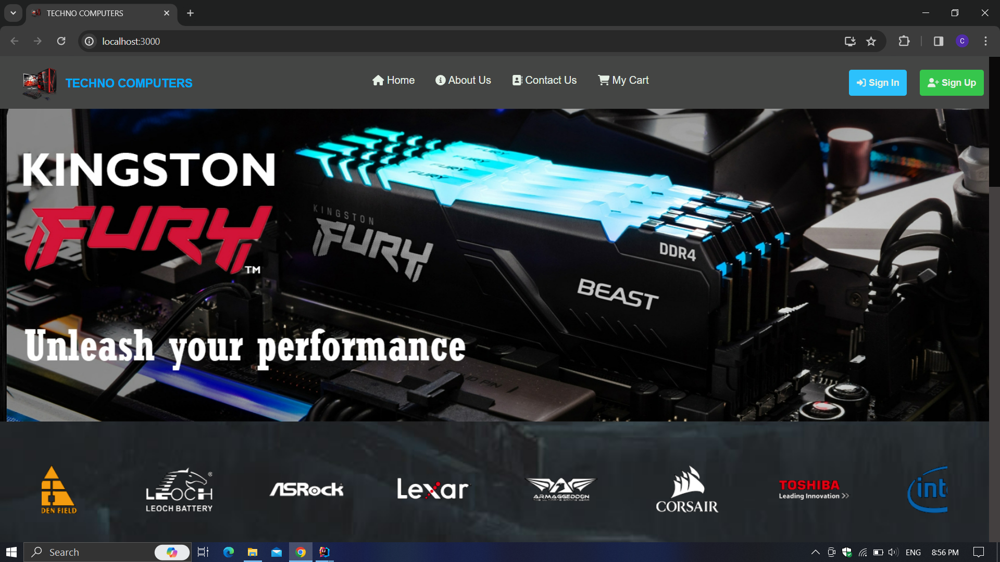
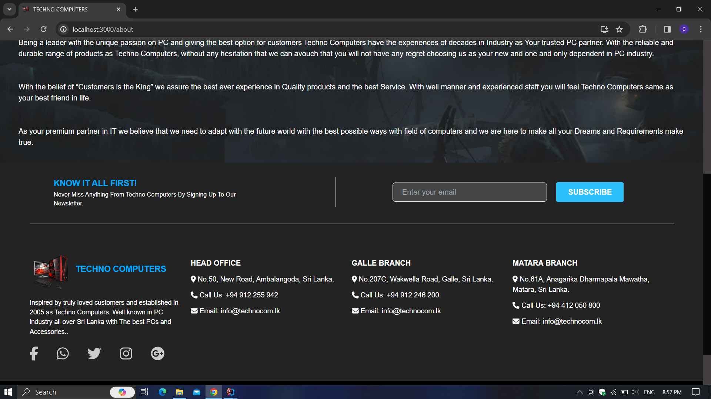

# RAD-Course-Work

# Computer Shop E-Commerce Application

### Frontend

* ReactJS
* Tailwind CSS
* TypeScript

### Backend

* NodeJS
* MongoDB

[//]: # (<br>)

[//]: # (<p align="center" style="font-size: 24px;font-weight: bold">Screenshots</p>)

[//]: # ()
[//]: # (<br>)

[//]: # (<p align="center"></p><br>)

[//]: # (<p align="center"></p><br>)

[//]: # (<p align="center"></p><br>)

[//]: # (<p align="center"></p><br>)

[//]: # (<p align="center"></p><br>)

[//]: # (<p align="center"></p><br>)

[//]: # (<p align="center"></p><br>)

[//]: # (<p align="center"></p><br>)

[//]: # (<p align="center"></p><br>)

[//]: # (<p align="center"></p><br>)

[//]: # (<p align="center"></p><br>)

[//]: # (<p align="center"></p><br>)

[//]: # (<p align="center"></p><br>)

[//]: # (<p align="center"></p><br>)

[//]: # (<p align="center"></p><br>)

[//]: # (<p align="center"></p><br>)

[//]: # (<p align="center"></p><br>)


<div align="center">

###  
### Clone this repository ✅
```md
https://github.com/ChavinduShirantha/RAD-Course-Work
```
##  Connect with me
#### If you have any bugs or issues , If you want to explain my code please contact me on :

</div>

##
<p align="center">
<a href="https://twitter.com/Chavindu62"></a>
<a href="https://www.linkedin.com/in/chavindu-shirantha-b5b857264/" target="blank"></a>
</p>


##

<div align="center">


</div>

<div align="center">

#### @2023 [Chavindu Shirantha](https://github.com/ChavinduShirantha), Inc.All rights reserved
</div>
